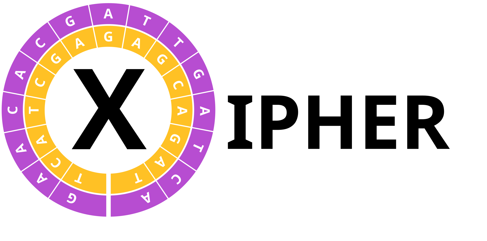

A tool to infer X-chromosome inactivation from single cell data. If you use this tool in your publication, please cite the following:
```
Burger, S., et al. X-inactivation mosaicism and the effects of X-linked mutations
in the human brain. (2023) http://nrs.harvard.edu/URN-3:HUL.INSTREPOS:37377886
```

The software takes as input files in [VarTrix file format](http://github.com/10xgenomics/vartrix#outputs) or in [cellsnp-lite file format](http://cellsnp-lite.readthedocs.io/en/latest/#about-cellsnp-lite) which reports variants in VCF and reference and alternate allele counts in [MatrixMarket Exchange format](http://math.nist.gov/MatrixMarket/formats.html#MMformat)

XIPHER differs from previously published tools to infer X-inactivation, such as [inactiveXX](http://github.com/constantAmateur/inactiveXX), [scLinaX](http://github.com/ytomofuji/scLinaX), [XCISE](http://github.com/Vityay/XCISE), [FemXpress](http://github.com/aprilW0829/FemXpress), and [XC-ID](http://github.com/jlhjiang/XC-ID) as it splits the computation in two steps: (i) SVD initialization step as described in [Dhillon et al. 2001](http://doi.org/10.1145/502512.502550) and [Zha et al. 2001](http://10.1145/502585.502591); and (ii) a refinement step using deterministic annealing similarly to inactiveXX and XC-ID

<!--ts-->
* [Usage](#usage)
* [Installation](#installation)
* [Dockerfile for cellsnp-lite](#dockerfile-for-cellsnp-lite)
* [Dockerfile for XIPHER](#dockerfile-for-xipher)
* [Compute digital allele counts](#compute-digital-allele-counts)
* [Compute X-inactivation](#compute-x-inactivation)
<!--te-->

Usage
=====

```
Usage: xipher.R [options] --mtx <prefix>|--table <file.tsv>
About: infer X-inactivation from single cell data. (version 2026-09-21)
[Burger, S., et al. Human X-inactivation mosaicism reveals the cell-autonomous effects
of X-linked mutations. (2023) http://nrs.harvard.edu/URN-3:HUL.INSTREPOS:37377886]

Options:
	-h, --help
		Show this help message and exit

	--mtx=<PREFIX>
		prefix for input files generated by VarTrix or cellsnp-lite

	--cellsnp
		whether data is in cellSNP-lite format rather than VarTrix format

	--dbl=<FILE.TSV>
		input scDblFinder/scPred file with doublet predictions

	--celldonor=<FILE.TSV>
		input file with donor cell map predictions

	--table=<FILE.TSV>
		input table with name, prefix, dbl, and celldonor headers to input multiple samples

	--mtx-data-path=<PATH>
		input data path for VarTrix or cellsnp-lite data in table

	--dbl-data-path=<PATH>
		input data path for scDblFinder/scPred files in table

	--celldonor-data-path=<PATH>
		input data path for donor cell map files in table

	--donors=<DONOR_ID>
		comma separate list of single donor IDs to use if input files are from villages

	--het-frac=<FLOAT>
		minimum expected REF/ALT and XA/XI fraction at heterozygous sites/doublet cells [0.2]

	--hom-frac=<FLOAT>
		maximum expected REF/ALT and XA/XI fraction at homozygous sites/singlet cells [0.01]

	--lod=<FLOAT>
		LOD score for heterozygous variants and doublets selection [2]

	--max-iter=<INTEGER>
		maximum number of iterations for the EM algorithm [1000]

	--max-xi-proportion=<FLOAT>
		maximum xi proportion allowed [0.2]

	--rho=<FLOAT>
		rho parameter for beta binomial distribution [0.001]

	--all
		whether the output cell UMI counts at all sites

	--out=<FILE.TSV>
		output cells TSV file [stdout]

	--var=<FILE.TSV>
		output variants TSV file

	--pdf=<FILE.PDF>
		output PDF file
```

Installation
============

Install basic tools (Debian/Ubuntu specific if you have admin privileges)
```
sudo apt install \
  wget \
  gzip \
  samtools \
  bcftools \
  r-cran-optparse \
  r-cran-r.utils \
  r-cran-data.table \
  r-cran-matrix \
  r-cran-vgam \
  r-cran-rspectra \
  r-cran-ggplot2 \
  r-cran-ggrastr
```

Install the GRCh38 human genome reference (following the suggestion from [Heng Li](http://lh3.github.io/2017/11/13/which-human-reference-genome-to-use))
```
wget -O- ftp://ftp.ncbi.nlm.nih.gov/genomes/all/GCA/000/001/405/GCA_000001405.15_GRCh38/seqs_for_alignment_pipelines.ucsc_ids/GCA_000001405.15_GRCh38_no_alt_analysis_set.fna.gz | \
  gzip --decompress > GCA_000001405.15_GRCh38_no_alt_analysis_set.fna
for chr in chrX; do
  samtools faidx GCA_000001405.15_GRCh38_no_alt_analysis_set.fna $chr | \
    gzip > hg38.$chr.fa.gz
done
```
This will generate a 43.65MiB compressed fasta file to be used with cellsnp-lite

Download the [gnomAD](http://gnomad.broadinstitute.org) VCF file for chromosome X:
```
for chr in chrX; do
  wget http://storage.googleapis.com/gcp-public-data--gnomad/release/4.1.1/vcf/genomes/gnomad.genomes.v4.1.1.sites.$chr.vcf.bgz{,.tbi} .
  bcftools annotate \
    --no-version \
    --include 'AC>1' \
    --output-type u \
    --remove ID,FILTER,^INFO/AC,INFO/AN,INFO/AF \
    gnomad.genomes.v4.1.1.sites.$chr.vcf.bgz | \
  bcftools view \
    --no-version \
    --output-type b \
    --output gnomad.genomes.v4.1.1.snps.lite.$chr.bcf \
    --targets ^chr21:5010000-10814561 \
    --types snps \
    --write-index
done
```
This will download a 21.36GiB VCF file and convert it into a more minimalistic 132.55MiB VCF file with a list of 10,760,682 SNPs

You might want to further subset the variants to variants with minor allele frequency in the population larger than 0.1%, as there is limited value in trying to recover all heterozygous SNPs for each sample:
```
for chr in chrX; do
  bcftools annotate \
    --no-version \
    --output-type u \
    --include 'MAF>.001' \
    --remove ID,FILTER,INFO \
    gnomad.genomes.v4.1.1.snps.lite.$chr.bcf | \
  bcftools view \
    --no-version \
    --output gnomad.genomes.v4.1.1.snps.lite.001.$chr.bcf \
    --output-type b \
    --types snps \
    --write-index
done
```
This will generate a small 4.394MiB VCF file with a list of 1,134,959 SNPs on chromosome X to be used with cellsnp-lite

Download and compile [cellsnp-lite](http://github.com/single-cell-genetics/cellsnp-lite):
```
sudo apt install g++ libhts-dev make
wget --no-check-certificate http://github.com/single-cell-genetics/cellsnp-lite/archive/refs/tags/v1.2.4.tar.gz
tar xzvf v1.2.4.tar.gz
cd cellsnp-lite-1.2.4
./configure
make install 
```

Download XIPHER:
```
wget http://raw.githubusercontent.com/freeseek/xipher/refs/heads/master/xipher.R
chmod a+x xipher.R
```

Dockerfile for cellsnp-lite
===========================

```
FROM debian:testing-slim
ARG DEBIAN_FRONTEND=noninteractive
RUN apt-get -qqy update --fix-missing && \
    apt-get -qqy install --no-install-recommends \
                 jq \
                 openssl \
                 ca-certificates \
                 curl \
                 samtools \
                 bcftools \
                 g++ \
                 libhts-dev \
                 make \
                 wget && \
    wget --no-check-certificate http://github.com/single-cell-genetics/cellsnp-lite/archive/refs/tags/v1.2.4.tar.gz && \
    tar xzvf v1.2.4.tar.gz && \
    cd cellsnp-lite-1.2.4 && \
    ./configure && \
    make install && \
    apt-get -qqy purge --auto-remove --option APT::AutoRemove::RecommendsImportant=false \
                 g++ \
                 libhts-dev \
                 make \
                 wget && \
    apt-get -qqy clean && \
    rm -rf v1.2.4.tar.gz \
           cellsnp-lite-1.2.4 \
           /var/lib/apt/lists/*
```
Size of image around 133MiB

Dockerfile for XIPHER
=====================

```
FROM debian:testing-slim
COPY xipher.R /usr/bin
ARG DEBIAN_FRONTEND=noninteractive
RUN apt-get -qqy update --fix-missing && \
    apt-get -qqy install --no-install-recommends \
                 bcftools \
                 r-cran-optparse \
                 r-cran-r.utils \
                 r-cran-data.table \
                 r-cran-matrix \
                 r-cran-vgam \
                 r-cran-rspectra \
                 r-cran-ggplot2 \
                 r-cran-ggrastr && \
    apt-get -qqy clean && \
    rm -rf /var/lib/apt/lists/*
```
Size of image around 307MiB

Compute digital allele counts
=============================

If you have an input bam file and an input list of cell barcodes for which you want to compute digital allele counts, you can run a command like the following:
```
gzip --decompress --force hg38.chrX.fa.gz
cellsnp-lite \
  --samFile input.bam \
  --outDir . \
  --regionsVCF gnomad.genomes.v4.1.1.snps.lite.001.chrX.bcf \
  --barcodeFile barcodes.txt \
  --gzip \
  --nproc 1 \
  --refseq hg38.chrX.fa \
  --chrom chrX \
  --cellTAG XC \
  --UMItag XM
gzip --force --no-name cellSNP.tag.{AD,DP,OTH}.mtx.gz"
```
Make sure to use the correct `--cellTAG` and `--UMItag` appropriate for your data. For 10x scRNA-seq you should use `--cellTAG CB --UMItag UB`. See [cellsnp-lite documentation](http://cellsnp-lite.readthedocs.io/en/latest/main/manual.html#advanced-usage) for more information

Compute X-inactivation
======================

To run XIPHER on a single cell experiment from a single donor you can run a command like this:
```
xipher.R \
  --mtx cellSNP \
  --cellsnp \
  --out xipher.tsv \
  --pdf xipher.pdf
```

If you have run an expression doublet algorithm you can improve performance by letting XIPHER know which cell barcodes correspond to doublets:
```
xipher.R \
  --mtx cellSNP \
  --cellsnp \
  --dbl input.scDblFinder.tsv \
  --out xipher.tsv \
  --pdf xipher.pdf
```

If you have multiple libraries from the same donor, it is better to process all of them at once. To do so make a `table.tsv` tab-delimited table file with headers `name` and `prefix` and optionally also header `dbl` and `celldonor`, and run XIPHER as follows:
```
xipher.R \
  --cellsnp \
  --table table.tsv \
  --out xipher.tsv \
  --pdf xipher.pdf
```

XIPHER can also be run with village data. Cell donor information can be input with files with columns `cell` and `bestSample`